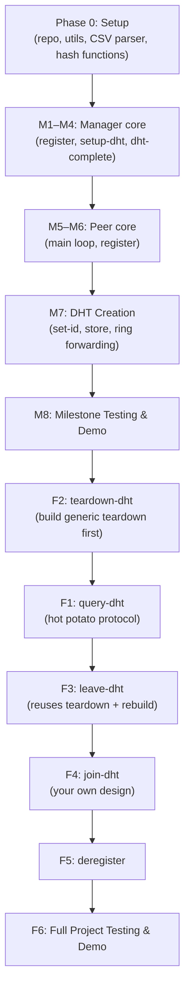

# Distributed Hash Table (DHT) — Implementation Guide

A step-by-step breakdown for building the DHT socket programming project. Tasks are separated into **Milestone** (due 03/08) and **Full Project** (due 03/29).

> [!IMPORTANT]
> This is a **guide only** — no code changes are involved. Review the task breakdown and let me know if you'd like any adjustments before you start working.

---

## Phase 0 — Project Setup

### 0.1 Repository & Environment
- [ x ] Create a **private** Git repo and make an initial commit
- [ x ] Choose language (C/C++, Java, or Python) and set up project structure
- [ x ] Determine your group number and compute your **port range** (see §3 of the spec)
- [ x ] Download the NWS storm-event CSV files (`details-YYYY.csv`) for at least 1950 and 1996

### 0.2 Shared Utilities (build once, use everywhere)
- [ x ] Define a **message format** — decide on serialization (struct, delimited string, JSON, etc.)
- [ x ] Write `send_message()` / `recv_message()` helpers over UDP
- [ x ] Implement a `find_next_prime(n)` helper (needed for hash table sizing)
- [ x ] Implement the two-level hash:  
  ```
  pos = event_id % table_size
  id  = pos % ring_size
  ```
- [ ] Write CSV parser to read a `details-YYYY.csv` file into records

---

## Phase 1 — Milestone (due 03/08/2026)

> **Scope:** `register`, `setup-dht`, `dht-complete`, plus all P2P messages for DHT creation (§1.2.1).

---

### Task M1 — Manager: Core Loop & State Store

| Item | Details |
|------|---------|
| **Goal** | Manager listens on a UDP port, parses incoming messages, and maintains peer state |
| **Accept CLI** | Single integer argument: the manager's port number |
| **State store** | Data structure mapping peer-name → `{name, ipv4, m_port, p_port, state}` where state ∈ {Free, Leader, InDHT} |
| **Main loop** | `while True`: receive a message, dispatch to the appropriate handler, send response |

- [ ] Implement the manager main loop
- [ ] Implement internal state data structure

---

### Task M2 — Manager: `register` Command

- [ ] Parse `register <peer-name> <ipv4> <m-port> <p-port>`
- [ ] Validate: unique peer-name and unique port pair
- [ ] Store peer info, set state = `Free`
- [ ] Respond `SUCCESS` or `FAILURE`

---

### Task M3 — Manager: `setup-dht` Command

- [ ] Parse `setup-dht <peer-name> <n> <YYYY>`
- [ ] Validate: peer registered, n ≥ 3, enough Free peers, no existing DHT
- [ ] Set leader state → `Leader`; pick n−1 random Free peers → `InDHT`
- [ ] Respond with `SUCCESS` + list of n 3-tuples (leader first)
- [ ] Enter a **blocking state**: reject all messages except `dht-complete`

---

### Task M4 — Manager: `dht-complete` Command

- [ ] Parse `dht-complete <peer-name>`
- [ ] Validate sender is the current leader
- [ ] Respond `SUCCESS`; exit blocking state (now accept all commands except `setup-dht`)

---

### Task M5 — Peer: Core Structure

| Item | Details |
|------|---------|
| **Goal** | Peer program reads commands from stdin, talks to manager and other peers |
| **Accept CLI** | Two args: manager IPv4 address, manager port |
| **Sockets** | One UDP socket bound to `m-port` (manager communication), one bound to `p-port` (peer-to-peer) |
| **Command loop** | Read stdin → construct message → send/receive |

- [ ] Implement peer main loop with stdin command parsing
- [ ] Create and bind the two UDP sockets (`m-port`, `p-port`)
- [ ] Add logic to handle/route incoming P2P messages on `p-port`

---

### Task M6 — Peer: `register` Command (client side)

- [ ] User types `register <name> <ipv4> <m-port> <p-port>`
- [ ] Send message to manager, wait for response
- [ ] Print `SUCCESS` / `FAILURE`

---

### Task M7 — Peer: `setup-dht` (Leader Side — DHT Creation, §1.2.1)

This is the largest single task. Break it into sub-steps:

#### M7a — Send `setup-dht` to Manager & Parse Response
- [ ] Send `setup-dht <name> <n> <YYYY>` to manager
- [ ] On `SUCCESS`, parse the n 3-tuples
- [ ] Store ring info (peer names, IPs, p-ports) indexed by identifier

#### M7b — Assign Identifiers (`set-id`)
- [ ] Leader assigns itself id = 0
- [ ] For i = 1 … n−1: send `set-id` to peer_i with id `i`, ring size `n`, and the full tuple list
- [ ] Each peer receiving `set-id`: store its id, ring size, and right-neighbour 3-tuple `(i+1) mod n`

#### M7c — Build Local Hash Tables (`store`)
- [ ] Leader reads `details-YYYY.csv`, counts ℓ lines (minus header)
- [ ] Compute hash table size `s` = first prime > 2 × ℓ
- [ ] For each record: compute `pos = event_id % s`, `id = pos % n`
  - If `id == 0` (leader): store locally
  - Else: send `store` command to **right neighbour** (not directly to target); each peer forwards along the ring until it reaches the correct `id`
- [ ] Each peer: on receiving `store`, check if target id matches own id → store, else forward to right neighbour

#### M7d — Signal Completion
- [ ] Leader prints record counts per node
- [ ] Leader sends `dht-complete` to manager

---

### Task M8 — Milestone Testing & Demo

- [ ] Test with **3 peers** on **≥ 2 distinct hosts**
- [ ] Use dataset year **1950**
- [ ] All peers register → one peer issues `setup-dht n=3 YYYY=1950`
- [ ] Verify record counts printed by leader
- [ ] Verify `dht-complete` accepted by manager
- [ ] Prepare **≤ 7 min** video demo showing compilation, execution across hosts, and message traces
- [ ] Write milestone design document (message formats, time-space diagrams, data structures, VCS snapshots)

---

## Phase 2 — Full Project (due 03/29/2026)

> **Scope:** All remaining manager commands + P2P protocols for query, leave, join, teardown, deregister.

---

### Task F1 — Peer: `query-dht` & Hot Potato Query (§1.2.2)

#### F1a — Manager Side
- [ ] Parse `query-dht <peer-name>`
- [ ] Validate: DHT complete, peer registered & Free
- [ ] Pick random DHT peer, respond with its 3-tuple + `SUCCESS`

#### F1b — Querying Peer (sender S)
- [ ] On `SUCCESS`, send `find-event <event_id>` to the returned peer, including S's own 3-tuple

#### F1c — DHT Peer: `find-event` Processing
- [ ] Compute `pos` and `id` from event_id
- [ ] If `id == my_id`: look up local hash table at position `pos`
  - Found → send `SUCCESS` + full record + `id-seq` back to S
  - Not found → forward via hot potato
- [ ] **Hot potato**: build set `I = {0..n−1} \ {id}`, init `id-seq = [id]`
  - Pick `next = random(I)`, remove from I, append to `id-seq`
  - Forward `find-event` to `next`; `next` checks its local table at `pos`
  - Repeat until found or all nodes exhausted → send `FAILURE` back to S
- [ ] At S: print labelled record fields (one per line) + `id-seq`, or failure message

---

### Task F2 — Peer: `teardown-dht` (§1.2.5)

- [ ] Leader sends `teardown` to right neighbour
- [ ] Each peer: delete local hash table, forward `teardown` to its right neighbour
- [ ] When `teardown` returns to leader: delete own hash table, send `teardown-complete` to manager

#### Manager: `teardown-dht` & `teardown-complete`
- [ ] `teardown-dht`: validate sender is leader → respond `SUCCESS`, enter blocking state awaiting `teardown-complete`
- [ ] `teardown-complete`: validate sender is leader → set all DHT peers to `Free`, respond `SUCCESS`

---

### Task F3 — Peer: `leave-dht` (§1.2.3)

- [ ] Peer u sends `leave-dht` to manager
- [ ] Manager validates, responds `SUCCESS`, enters blocking state awaiting `dht-rebuilt`
- [ ] Peer u initiates teardown of DHT (reuse teardown logic from F2 step 1)
- [ ] Peer u sends `reset-id` to right neighbour:
  - Each peer resets its id (incrementing from 0), ring size = n−1, removes u from tuple list
  - `reset-id` propagates around ring back to u
- [ ] Peer u sends `rebuild-dht` to right neighbour (new leader)
  - New leader re-reads CSV, redistributes records across n−1 peers (reuse §1.2.1 step 2 logic)
  - New leader signals u on completion
- [ ] Peer u sends `dht-rebuilt <u> <new-leader>` to manager

#### Manager: `dht-rebuilt`
- [ ] Validate sender, update states, set new leader, respond `SUCCESS`

---

### Task F4 — Peer: `join-dht` (§1.2.4)

> You must **design this protocol yourself** — the spec only says the last step must be `dht-rebuilt`.

Suggested approach (mirror of leave):
- [ ] Peer v sends `join-dht` to manager; manager validates (v must be Free, DHT must exist)
- [ ] Manager responds `SUCCESS`, enters blocking state
- [ ] Peer v contacts the current leader (manager can provide leader's 3-tuple in the response)
- [ ] Leader initiates teardown of local hash tables (reuse teardown logic)
- [ ] Leader sends `reset-id` around ring, inserting v into the ring (ring size = n+1)
- [ ] Leader rebuilds local hash tables with n+1 peers
- [ ] Peer v sends `dht-rebuilt <v> <new-leader>` to manager

---

### Task F5 — Peer: `deregister` (§1.1 command 8)

- [ ] Peer sends `deregister <peer-name>` to manager
- [ ] Manager validates peer is `Free` (not InDHT)
- [ ] Remove peer from state store, respond `SUCCESS`
- [ ] Peer process exits

---

### Task F6 — Full Project Testing & Demo

- [ ] Test with **6 peers** on **≥ 4 distinct hosts**, dataset year **1996**, ring size **n=5**
- [ ] Demo script:
  1. Compile & run manager + 6 peers, all register
  2. One peer: `setup-dht` with n=5, YYYY=1996
  3. Remaining peer: `query-dht` with event IDs `{5536849, 2402920, 5539287, 55770111}`
  4. One DHT peer: `leave-dht`, then query from the peer that left
  5. One outside peer: `join-dht`, then query from the other remaining peer
  6. Leader: `teardown-dht`
  7. All peers: `deregister` + exit; terminate manager
- [ ] Prepare **≤ 15 min** video demo
- [ ] Extend design document with all new commands, time-space diagrams, etc.

---

## Suggested Implementation Order (Summary)



> [!TIP]
> Build `teardown-dht` (F2) **before** `query-dht` (F1) so you have a clean way to reset state during testing. Also, implement teardown generically so it can be reused by `leave-dht` (F3).

---

## Verification Plan

### Automated / Manual Tests
Since this is a distributed systems project with UDP sockets, testing is primarily **manual & demo-driven**:

1. **Unit-test utilities locally**: CSV parser, `find_next_prime`, hash functions, message serialization/deserialization
2. **Single-host integration**: Run manager + 3 peers on localhost with different ports; verify milestone flow
3. **Multi-host integration**: Deploy on ≥ 2 hosts (e.g., `general3.asu.edu`, `general4.asu.edu`); verify same flow
4. **Full project demo rehearsal**: Follow the exact demo script from §4.2 step-by-step before recording

### What to Verify at Each Stage
| Stage | Check |
|-------|-------|
| `register` | Manager stores peer, returns SUCCESS; duplicate returns FAILURE |
| `setup-dht` | Correct tuple list returned; peers get `set-id`; ring neighbour pointers correct |
| `store` | Records forwarded along ring, not sent directly; counts match expected per-node distribution |
| `query-dht` | Hot potato visits random nodes; correct record returned; `id-seq` printed |
| `leave-dht` | Ring shrinks by 1; records redistributed; queries still work |
| `join-dht` | Ring grows by 1; records redistributed; queries still work |
| `teardown-dht` | All local tables deleted; peers return to Free |
| `deregister` | Peer removed from manager state; process exits |
